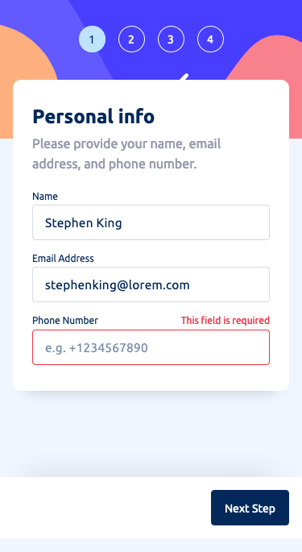

# Frontend Mentor - Multi-Step Form Solution

This is a solution to the [Multi-Step Form Challenge on Frontend Mentor](https://www.frontendmentor.io/challenges/multistep-form-YVAnSdqQBJ). Frontend Mentor challenges help you improve your coding skills by building realistic projects. 

## The challenge

Users should be able to:

- Complete each step of the sequence
- See a summary of their selections on the final step and confirm their order
- View the optimal layout for the interface depending on their device's screen size
- See hover and focus states for all interactive elements on the page

## Screenshot

### Mobile


### Desktop


## Built with

- Semantic HTML5 markup
- CSS custom properties
- Flexbox
- CSS Grid
- Mobile-first workflow
- Vite
- [React](https://reactjs.org/) - JS library
- TypeScript

## What I learned

This was an excellent project that posed many unexpected and unique challenges. I used React and TypeScript together for the first time (set up through Vite) which made it a lot more difficult, but I feel it was worth it as I learned so much. I'm sure my implementation of TypeScript is not 100% correct throughout this project. It took a lot of trial and error, and watching tutorials to figure out how to make the errors go away! For example I didn't know that there are many extra 'types' that are specific to React and I'm not sure whether I have used the correct ones, however the code still works.

Late into the project, I wondered whether I should have made each 'step' a separate `<form>` because it would have made the validation of step 1 much simpler. Instead I used only one `<form>` element in the whole project which seems semantically more correct I think, but it forced me to get creative and figure out how I could validate step 1 before allowing you to move on to step 2. I discovered 'refs' which let you reference JSX elements as though they were DOM elements - this was my solution to validating step 1:

```js
/* ------------------ Step 1 Validation ----------------- */
    const nameRef = useRef() as React.MutableRefObject<HTMLInputElement>;
    const emailRef = useRef() as React.MutableRefObject<HTMLInputElement>;
    const phoneNumberRef = useRef() as React.MutableRefObject<HTMLInputElement>;
   
        useEffect(() => {
            if (isValidating) {
                let isValidated = true;
                
                // Validate name value
                const NAME = nameRef.current;
                const NAME_ERROR = NAME.nextElementSibling as HTMLParagraphElement;
                const nameRegex = new RegExp(NAME.pattern);
                if (NAME.value === '') {
                    if (!NAME.classList.contains('invalid')) NAME.classList.add('invalid');
                    NAME_ERROR.innerHTML = 'This field is required';
                    isValidated = false;
                }
                else if (!nameRegex.test(NAME.value)) {
                    if (!NAME.classList.contains('invalid')) NAME.classList.add('invalid');
                    NAME_ERROR.innerHTML = 'Not a valid name'
                    isValidated = false;
                }
                else if (NAME.classList.contains('invalid')) NAME.classList.remove('invalid');
                
                // Validate email value
                const EMAIL = emailRef.current;
                const EMAIL_ERROR = EMAIL.nextElementSibling as HTMLParagraphElement;
                const emailRegex = new RegExp(EMAIL.pattern);
                if (EMAIL.value === '') {
                    if (!EMAIL.classList.contains('invalid')) EMAIL.classList.add('invalid');
                    EMAIL_ERROR.innerHTML = 'This field is required';
                    isValidated = false;
                }
                else if (!emailRegex.test(EMAIL.value.toLowerCase())) {
                    if (!EMAIL.classList.contains('invalid')) EMAIL.classList.add('invalid');
                    EMAIL_ERROR.innerHTML = 'Not a valid email'
                    isValidated = false;
                }
                else if (EMAIL.classList.contains('invalid')) EMAIL.classList.remove('invalid');
                
                // Validate phone number value
                const PHONE_NUMBER = phoneNumberRef.current;
                const PHONE_NUMBER_ERROR = phoneNumberRef.current.nextElementSibling as HTMLParagraphElement;
                const phoneNumberRegex = new RegExp(PHONE_NUMBER.pattern);
                if (PHONE_NUMBER.value === '') {
                    if (!PHONE_NUMBER.classList.contains('invalid')) PHONE_NUMBER.classList.add('invalid');
                    PHONE_NUMBER_ERROR.innerHTML = 'This field is required';
                    isValidated = false;
                }
                else if (!phoneNumberRegex.test(PHONE_NUMBER.value)) {
                    if (!PHONE_NUMBER.classList.contains('invalid')) PHONE_NUMBER.classList.add('invalid');
                    PHONE_NUMBER_ERROR.innerHTML = 'Not a valid phone number'
                    isValidated = false;
                }
                else if (PHONE_NUMBER.classList.contains('invalid')) PHONE_NUMBER.classList.remove('invalid');
                
                if (isValidated === true) { setCurrentStep(2) }
            }
            
            setIsValidating(false);
        })
```

### Continued development

This was an excellent project and I had a lot of fun building it. I will continue to tackle projects with React and TypeScript.